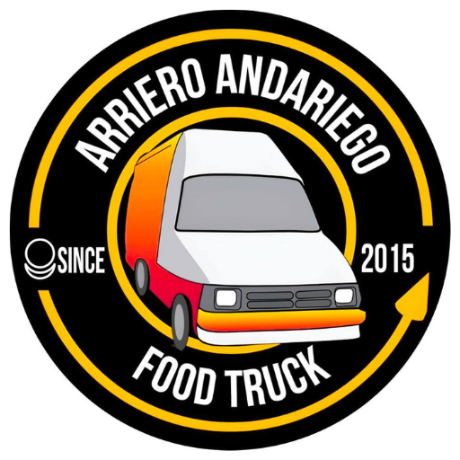

# Política de Privacidad

**Última actualización:** Diciembre 2025

---

## Resumen

**Arrierito TV** es una aplicación de Digital Signage para Google TV diseñada para mostrar contenido publicitario en pantallas del food truck **Arriero Andariego**. 

Esta aplicación **no recopila datos personales de usuarios finales** ya que funciona en modo kiosko sin interacción del usuario.

---

## 1. Información del Responsable

| Campo | Información |
|-------|-------------|
| **Aplicación** | Arrierito TV |
| **Negocio** | Arriero Andariego Food Truck |
| **Desarrollador** | Crhystian |
| **Ubicación** | Cartago, Valle del Cauca, Colombia |
| **Plataforma** | Google TV / Android TV |
| **Operando desde** | 2015 |

---

## 2. Descripción de la Aplicación

**Arrierito** es una aplicación de cartelería digital profesional (Digital Signage) diseñada exclusivamente para dispositivos Google TV y Android TV.

### Propósito

- Mostrar contenido publicitario (imágenes y videos) en pantallas del food truck
- Funcionar en modo kiosko 24/7 sin intervención humana
- Sincronizar contenido multimedia desde la nube

### Características Técnicas

| Característica | Descripción |
|----------------|-------------|
| **Modo Kiosko** | Se ejecuta como launcher principal del dispositivo |
| **Reproducción Automática** | El contenido se muestra sin interacción del usuario |
| **Sincronización** | Contenido actualizado desde Firebase en tiempo real |
| **Modo Offline** | Funciona sin conexión usando caché local |

> ⚠️ **Nota:** Esta aplicación es de uso empresarial exclusivo. No está diseñada para usuarios individuales.

---

## 3. Datos Recopilados

### 3.1 Datos Técnicos del Dispositivo

La aplicación recopila información técnica **únicamente para diagnóstico y mejora del servicio**:

| Dato | Propósito | Identificable |
|------|-----------|---------------|
| Firebase Installation ID | Identificar dispositivo para soporte | Pseudónimo |
| Fabricante y Modelo | Optimizar rendimiento por dispositivo | No |
| Versión de Android | Compatibilidad y debugging | No |
| Resolución de Pantalla | Optimizar visualización de contenido | No |
| Versión de la App | Soporte técnico y actualizaciones | No |
| Idioma/Región | Localización del contenido | No |

### 3.2 Eventos de Uso

| Evento | Datos Incluidos | Propósito |
|--------|-----------------|-----------|
| Inicio de Sesión | Timestamp | Monitorear disponibilidad del dispositivo |
| Video Completado | ID, nombre, duración | Analítica de contenido mostrado |
| Errores | Tipo de error, mensaje | Diagnóstico y mejora de estabilidad |

### 3.3 Datos que NO Recopilamos

Esta aplicación **NO recopila** ninguno de los siguientes datos:

- ❌ Nombres, emails o información de contacto
- ❌ Ubicación GPS o geolocalización precisa
- ❌ Cuentas de Google o credenciales de acceso
- ❌ Historial de navegación web
- ❌ Contactos, fotos o archivos del dispositivo
- ❌ Información de pago o financiera
- ❌ Datos biométricos
- ❌ Información de salud
- ❌ Comunicaciones (llamadas, mensajes)

---

## 4. Permisos de la Aplicación

La aplicación solicita únicamente los **permisos mínimos necesarios**:

| Permiso | Uso |
|---------|-----|
| `INTERNET` | Descargar contenido multimedia y sincronizar con Firebase |
| `ACCESS_NETWORK_STATE` | Detectar conectividad para habilitar modo offline |

> 📝 La aplicación **NO** solicita permisos de cámara, micrófono, ubicación, contactos, almacenamiento externo ni ningún otro permiso sensible.

---

## 5. Servicios de Terceros

### Firebase (Google)

La aplicación utiliza los siguientes servicios de Firebase:

| Servicio | Propósito |
|----------|-----------|
| **Firebase Firestore** | Almacenar y sincronizar configuración de contenido |
| **Firebase Analytics** | Analítica de uso y rendimiento |
| **Firebase Crashlytics** | Reportes de errores y estabilidad |
| **Firebase Installations** | Identificación única del dispositivo |

Para más información: [Política de Privacidad de Firebase](https://firebase.google.com/support/privacy)

---

## 6. Almacenamiento de Datos

### Almacenamiento Local

| Tipo | Contenido | Retención |
|------|-----------|-----------|
| Base de Datos Room | Caché de contenido multimedia | Hasta limpieza manual |
| Caché de Imágenes | Imágenes descargadas | 200MB máximo, auto-limpieza |

### Almacenamiento en la Nube

| Servicio | Datos | Retención |
|----------|-------|-----------|
| Firebase Firestore | Configuración de contenido | Indefinida |
| Firebase Analytics | Eventos de uso | 14 meses |
| Firebase Crashlytics | Reportes de errores | 90 días |

---

## 7. Transferencia Internacional de Datos

Los datos técnicos recopilados se transfieren a **Google LLC** (Estados Unidos) a través de los servicios de Firebase.

Estas transferencias se realizan bajo las cláusulas contractuales estándar de Google, que garantizan un nivel adecuado de protección de datos conforme a las regulaciones internacionales de privacidad.

---

## 8. Uso Exclusivo

Esta aplicación es de **uso interno exclusivo** para el negocio **Arriero Andariego Food Truck**.

- No está disponible para descarga pública
- No está dirigida a usuarios externos
- El dispositivo donde se ejecuta es propiedad del negocio
- El negocio mantiene control administrativo total sobre la aplicación

---

## 9. Medidas de Seguridad

La aplicación implementa las siguientes medidas de seguridad:

| Medida | Descripción |
|--------|-------------|
| **Cifrado en tránsito** | Todas las comunicaciones usan HTTPS/TLS |
| **Firebase Security Rules** | Reglas de acceso configuradas en la nube |
| **Sin credenciales** | No se almacenan contraseñas ni tokens de usuario |
| **Código ofuscado** | ProGuard activado en versión de producción |
| **Firma digital** | APK/AAB firmado con certificado del desarrollador |

---

## 10. Menores de Edad

Esta aplicación **NO está dirigida a menores de edad**.

Es una herramienta empresarial para cartelería digital que no recopila datos de ningún usuario, incluyendo menores.

---

## 11. Cambios en esta Política

Nos reservamos el derecho de actualizar esta política de privacidad cuando sea necesario. Los cambios serán publicados en esta página con la fecha de actualización correspondiente.

### Historial de Versiones

| Fecha | Versión | Cambios |
|-------|---------|---------|
| Diciembre 2025 | 1.0 | Versión inicial |

---

**© 2025 Arriero Andariego Food Truck** | Since 2015 | Cartago, Colombia
